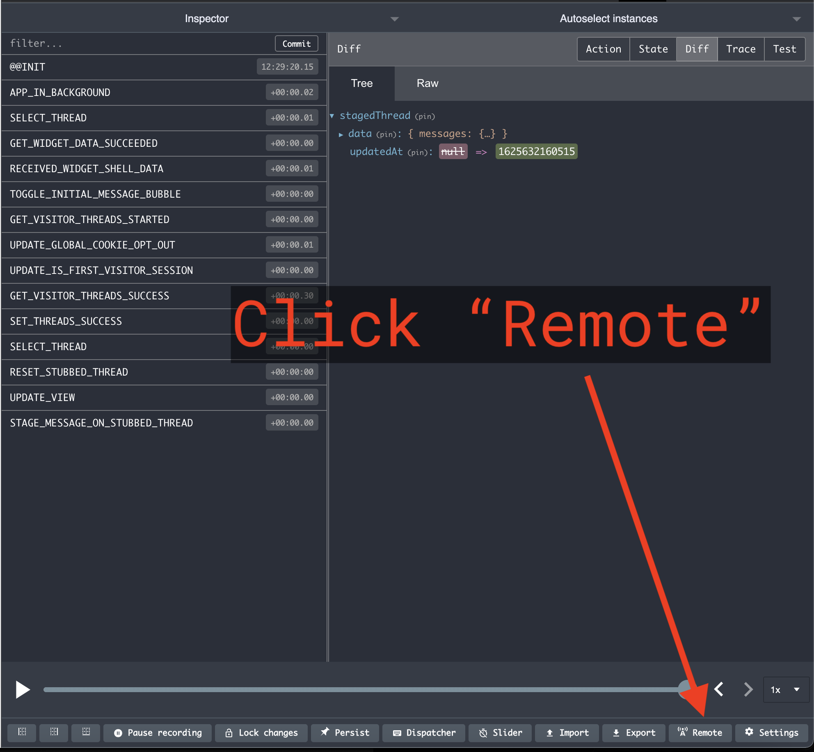
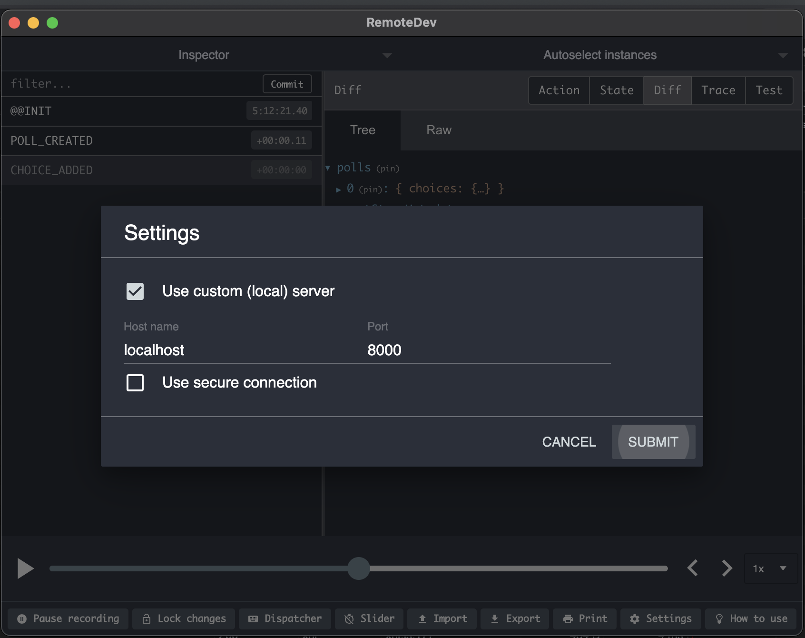

# ES Reduxed[](https://www.npmjs.com/package/es-reduxed) [](https://www.npmjs.com/package/es-reduxed) [](http://commitizen.github.io/cz-cli/)


ES Reduxed offers an easy way to build an event-sourced backend using the redux pattern javascript developers are familiar with.

Comes with a Postgres backed event store, with more event store providers coming, or implement them yourself.

## Installation

Run `npm i es-reduxed` to save to your dependencies.

### Installing the Postgres provider

If you're using the Postgres event store provider, you need to run the migration provided in `db/000__event_store.sql`.

Whichever schema you run the migration against is the one you must supply when setting up the event store provider:

```typescript
  const provider = createPostresEventStoreProvider({
    eventSchema: 'my_schema',
    poolConfig,
  });
```

Instantiating a provider without schema defaults to the `public` schema.

## Usage

To get started we:
1. Create an event store provider
2. Initialise our event store with the given provider, and a redux "store"

In the following example we use the postgres provider included in this package:

```typescript
import { initialiseEventSourcingSystem } from 'es-reduxed';
import { createPostresEventStoreProvider } from 'es-reduxed/postgres';
import { poolConfig } from '../db/connection';
import { reduxStore } from '../store';
import * as express from 'express';

const initialiseServer = async () => {
  const PORT = 8080;
  const app = express();

  const provider = createPostresEventStoreProvider({
    eventSchema: 'core_domain',
    poolConfig,
  });

  const { raiseEvent } = await initialiseEventSourcingSystem({
    reduxStore,
    eventStoreProvider: provider,
  });

  app.get('/count', (res, req) => {
    const { count } = reduxStore.getState();
    res.json({ count });
  });
  
  app.post('/count', async (res, req) => {
    const { count } = await raiseEvent({ type: 'COUNTED' });
    // The raise event function returns the updated state after the raised event has propagated back through redux
    // It's able to make use of this by keeping track of the lastEventId in your redux store.
    res.json({ count });
  })

  app.listen(PORT, () => {
    console.log(`Server started on port ${PORT}`);
  });

  return app;
};

initialiseServer();

```

Redux state is now coupled to the event store. Whenever you save an event, your redux state will update once it has received the event from the subscriber.

For this to work, your redux store needs a little extra functionality. The `eventStoreReduxEnhancer` provides this functionality as a redux enhancement. You provide this to the `createStore` function when creating your store as follows:

```typescript
import { createStore, Reducer } from 'redux';
import { eventStoreReduxEnhancer, EventBase } from 'es-reduxed';

type State = {
  count: number
};

interface CountEvent extends EventBase {
  type: 'COUNTED';
};

const initalState: State = {
  count: 0,
};

const countReducer: Reducer<State, CountEvent> = (state = initalState, event) => {
  switch (event.type) {
    case 'COUNTED':
      return {
        count: state.count + 1,
      }
    default:
      return state;
  }
}

export const reduxStore = createStore(countReducer, initalState, eventStoreReduxEnhancer);
```

If you use multiple store enhancers, such as the `applyMiddleware` function provided by redux, you compose these enhancers as follows:

```typescript
// ...
const middlewareEnhancer = applyMiddleware(loggerMiddleware, thunkMiddleware);
const composedEnhancers = compose(middlewareEnhancer, eventStoreReduxEnhancer);

export const reduxStore = createStore(countReducer, initalState, composedEnhancers);
```

In the previous example you will notice that our actions extend `EventBase` instead of `Action`. This is because the events we use in event sourcing have a particular structure and require particular properties to be present in addition to the `type` property required by actions. When you raise an event, most of this is taken care of for you by the provider. However your events will form a discriminated union of well typed event payloads based on the `type` property which acts as a discriminator.

This is typically how most people use redux anyway. Here's an example:

```typescript
interface MoneyDepositedEvent extends EventBase {
  type: 'MONEY_DEPOSITED';
  payload: {
    userId: number;
    value: number;
  }
};

interface AccountClosedEvent extends EventBase {
  type: 'ACCOUNT_CLOSED';
  payload: {
    userId: number
  }
};

export type BankEvents = MoneyDepositedEvent | AccountClosedEvent;
```

Our bank events will now have well typed payloads and produce a compile-time error if I attempt to access `payload.value` on an `AccountClosedEvent`.

## Setting up Redux-Devtools for serverside debugging

Connect your serverside redux implementation using `remote-redux-devtools`.

```typescript
import { createStore } from 'redux';
import { composeWithDevTools } from 'remote-redux-devtools';
import { EventStoreBase, eventStoreReduxEnhancer } from 'es-reduxed';
import {
  reducer,
  initialState,
  State,
  Events,
} from './reducer';

const composeEnhancers = composeWithDevTools({ realtime: true, port: 8000 });
export const store = createStore<
  State,
  Events,
  unknown,
  EventStoreBase
>(reducer, initialState, composeEnhancers(eventStoreReduxEnhancer));

```

You can then connect to it using the normal redux devtools extension as a remote instance:

1. Click remote



2. Click settings



3. Select "Use custom (local) server"


## A word on Events vs Actions

Events and actions are very similar, and the difference is mostly a matter of semantics, but in programming, _semantics matter_. Running a reducer over events or actions still produces the current state, however there are key differences:
* **Events** describe something that occurred in the past tense, and may include a payload of data describing what happened (e.g., an amount of money that was applied to an account)
* **Events** must be named in the past tense, e.g. `AccountCreated`, `ProductDestroyed`, `LoginSucceeded`
* **Actions** describe an imperative behaviour or _command_. They are analogous to CQRS style commands, but not strictly. Actions describe a thing that is occurring or must occur, i.e. `CreateAccount`, `DestroyProduct`, `LoginUser`. This ambiguity between *is occurring* or *must occur* makes actions difficult to work with for an event sourcing solution. If I log in a user, did it succeed? Will I only issue the action if the user can login successfully, or do I need to track some sort of failure event emitted in response to this action? 
  
These ambiguities aren't a bit deal when we're writing frontend code, controlling which tab we have open or the state of a toggled tray. These ambiguities are a concern when we're persisting them to a storage layer as the record of fact about significant business events.

***For that reason, `es-reduxed` recommends always using events written in the past tense for your event sourcing solution.***
